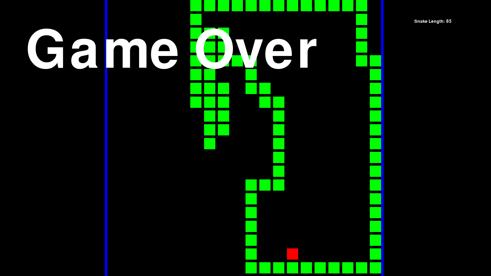

# CNN_MLP_Snake_AI
Convolutional neural network designed and trained to solve the game of snake

## Architecture

The network uses a shared CNN feature extractor feeding into two separate heads:

- **Feature extractor** — two convolutional layers (depth 8 then 16, kernel 3×3) separated by a 2×2 max pool, then flattened and concatenated with auxiliary inputs (direction, length, food delta) before a dense layer outputs a 64-dim feature vector.
- **Actor head** — three dense layers (64→32→16→4) with a softmax output producing a probability distribution over the four actions (up, right, down, left).
- **Critic head** — two dense layers (64→32→1) with a linear output estimating the state value V(s).

Both heads are trained jointly using **Proximal Policy Optimisation (PPO)** with GAE advantage estimation.

## Results
- **Performance** - The agent achieves on average a score of over 60 while sometimes peaking to over 100 on pure policy.

## Instructions
- To train the neural network - run the command "python main.py" in the root directory to start training the agent. It will only save when the test achieves a higher average than the previous maximum value.
- To see an example of the agent running - run the command "python -m game.game" in the root directory to start a game of snake with the agent deciding every action.
